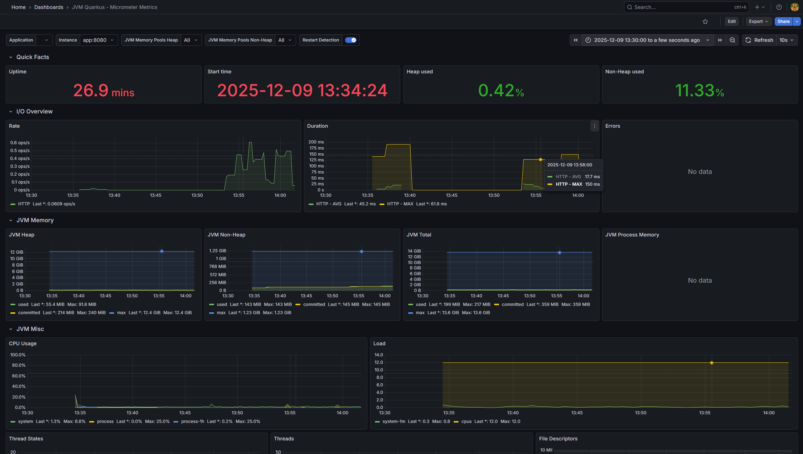
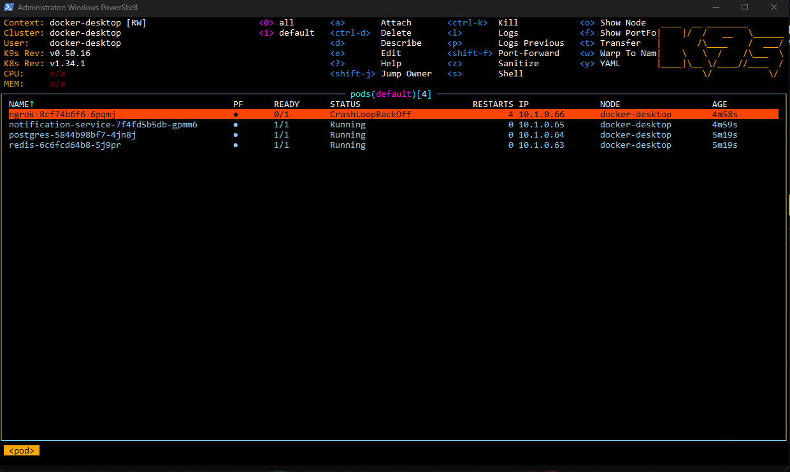
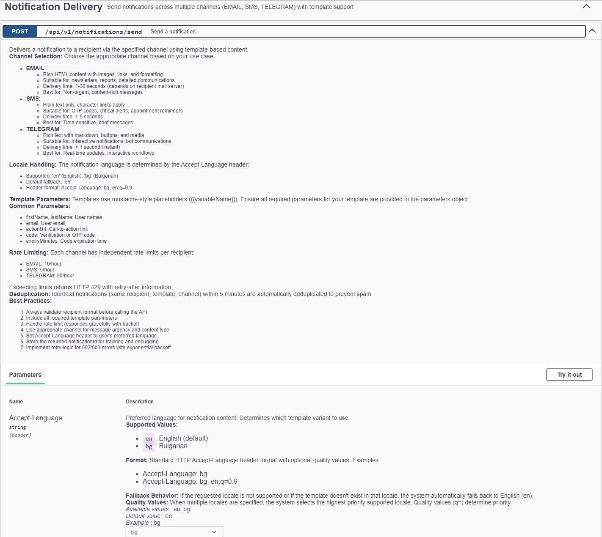
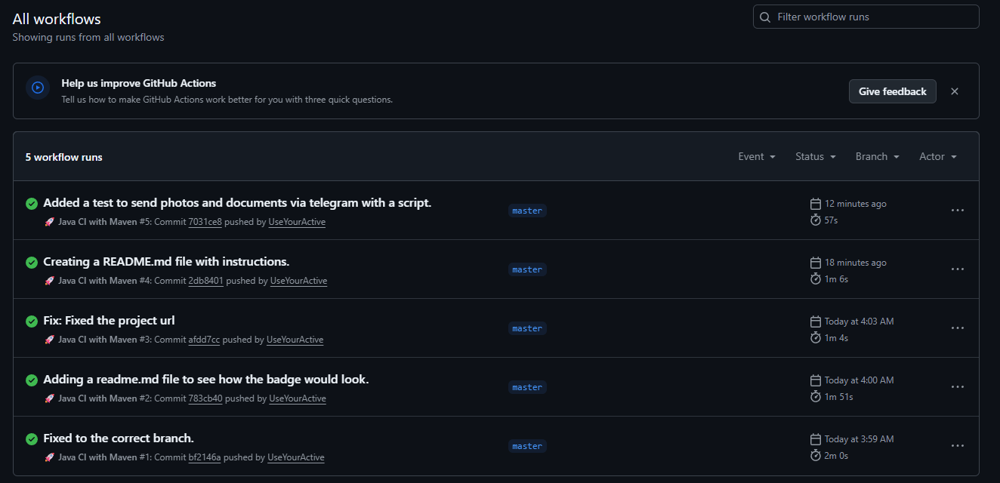

# 🚀 Quarkus Notification Service


> **A hyper-resilient, event-driven notification microservice capable of dispatching Email, SMS, and Telegram messages with <0.1s latency and massive concurrency.**

---

## 🌟 Overview

This project represents a **production-ready distributed system** designed to handle critical notifications. It moves beyond simple API calls by implementing **enterprise integration patterns**:

* **Asynchronous Processing:** Non-blocking I/O using Virtual Threads and Reactive Messaging.
* **Multi-Layer Resilience:** Circuit Breakers, Retry Policies (Exponential Backoff), and "Cold Storage" fallback queues.
* **Infrastructure as Code:** Fully automated deployments for Docker Compose (Dev) and Kubernetes (Prod).
* **Observability:** Built-in Prometheus metrics and Grafana dashboards.
* **Webhook Integration:** Real-time delivery status tracking from external providers.

### 🏗️ Architecture

The system follows a reactive **Producer-Consumer** pattern with sophisticated retry mechanisms:

```
┌─────────────┐    ┌──────────────┐    ┌─────────────┐    ┌──────────────┐
│   REST API  │───▶│ Validation & │───▶│  PostgreSQL │───▶│   In-Memory  │
│  (Ingress)  │    │  Rate Limit  │    │ Persistence │    │  Event Queue │
└─────────────┘    └──────────────┘    └─────────────┘    └──────────────┘
                            │                                       │
                            │                                       ▼
                            ▼                              ┌─────────────────┐
                    ┌──────────────┐                      │ Virtual Thread  │
                    │     Redis    │◀────────────────────│   Processor     │
                    │  (Caching &  │                      │  (@Retry 3x)    │
                    │ Deduplication)│                      └─────────────────┘
                    └──────────────┘                               │
                            │                                      │
                            │                         ┌────────────┼────────────┐
                            │                         │            │            │
                            │                         ▼            ▼            ▼
                            │                    ┌────────┐  ┌────────┐  ┌──────────┐
                            │                    │SendGrid│  │ Twilio │  │ Telegram │
                            │                    │Provider│  │Provider│  │   Bot    │
                            │                    └────────┘  └────────┘  └──────────┘
                            │                         │            │            │
                            │                         └────────────┼────────────┘
                            │                                      │ (Fail)
                            │                                      ▼
                            │                              ┌─────────────────┐
                            └─────────────────────────────▶│  Redis Sorted   │
                                                           │  Set (Cold Q)   │
                                                           │  Retry in 5min  │
                                                           └─────────────────┘
                                                                    │
                                                                    ▼
                                                           ┌─────────────────┐
                                                           │ RetryScheduler  │
                                                           │  (@Scheduled)   │
                                                           └─────────────────┘
```

**Flow:**
1.  **Ingestion:** REST API accepts requests, validates payloads, and checks Rate Limits (Redis).
2.  **Persistence:** Request state is saved to **PostgreSQL** immediately to prevent data loss.
3.  **Processing:** Events are pushed to an internal memory channel processed by **Virtual Threads**.
4.  **Dispatch:**
    * **Strategy Pattern** selects the channel (SendGrid, Twilio, Telegram).
    * **Dual Template System** (File + Database) with Redis caching.
    * **Deduplication** logic prevents double-sending.
5.  **Retry Logic:**
    * **Layer 1:** 3 immediate retries with exponential backoff (in-memory)
    * **Layer 2:** Failed messages → Redis Sorted Set (5-minute delay)
    * **Layer 3:** Scheduled job resurrects messages from Cold Queue
6.  **Webhook Processing:** Providers send delivery status → Update database records

---

## ✨ Key Capabilities

### 1. 🛡️ Multi-Layer Resilience & Fault Tolerance

**Circuit Breaker Pattern:**
* Automatically stops calling providers (e.g., Telegram Bot API) if they fail repeatedly
* Configurable failure thresholds and recovery windows
* Prevents cascading failures across the system

**Self-Healing Retry Mechanism:**
* **Layer 1 (Immediate):** 3 in-memory retries with 2-second delays
* **Layer 2 (Cold Storage):** Failed messages stored in Redis Sorted Set with 5-minute TTL
* **Layer 3 (Scheduled Recovery):** Background job (@Scheduled) resurrects messages every 60 seconds

**Deduplication:**
* SHA-256 hash of every message stored in Redis
* Enforces "Exactly-Once" delivery semantics within 5-minute window
* Prevents accidental double-sends from client retries

### 2. ⚡ High Performance

**Native Compilation:**
* Compiles to a GraalVM Native Binary
* **Startup Time:** 0.05s - 0.15s (vs 3-5s for JVM)
* **RSS Memory:** ~40MB (vs 250MB+ for JVM)
* Zero warm-up time required

**Concurrency:**
* Uses Java 21 `@RunOnVirtualThread` for lightweight concurrency
* Handles **thousands of concurrent I/O-bound tasks** without OS thread exhaustion
* Tested with 20+ parallel requests without blocking

### 3. 🌍 Advanced Template System

**Dual-Source Templates:**
* **File-System Templates:** Static templates in `src/main/resources/templates/` (immutable)
* **Database Templates:** Dynamic templates stored in PostgreSQL (editable via API)
* **Priority:** Database templates override file-system templates when active

**Template Features:**
* **Qute Engine** for powerful template rendering
* **i18n Support:** Automatic locale resolution via `Accept-Language` header
* **Caching:** Rendered templates cached in Redis with content-aware keys
* **Invalidation:** Smart cache invalidation when templates are updated

**Template Management API:**
```bash
# Create a new database template
POST /api/v1/templates
{
  "templateName": "email/custom_notification",
  "locale": "en",
  "content": "<html>{{message}}</html>"
}

# Update existing template
PUT /api/v1/templates/{id}
{
  "content": "<html>Updated: {{message}}</html>",
  "active": true
}

# List all templates (file + database)
GET /api/v1/templates/discovery?type=email&locale=bg
```

### 4. 📊 Real-Time Delivery Tracking

**Webhook Integration:**
* **SendGrid Events:** `delivered`, `bounce`, `dropped`, `spamreport`, `open`, `click`
* **Signature Verification:** ECDSA signature validation using SendGrid public key
* **Automatic Updates:** Webhook events update `NotificationRecord` and `NotificationAttempt` tables

**Delivery Status Flow:**
```
Send Email → SendGrid → Recipient Inbox
                ↓
        Webhook Event (delivered)
                ↓
        Update Database (SENT)
```

### 5. 📱 Advanced Telegram Features

**Rich Messaging:**
* **Text Messages:** HTML/Markdown formatting with parse modes
* **Photo Messages:** Send images with captions
* **Document Messages:** Send files with descriptions
* **Message Editing:** Edit previously sent messages
* **Message Deletion:** Remove messages programmatically
* **Chat Actions:** Show typing indicators, uploading states

**Interactive Elements:**
* Custom keyboards (reply_markup)
* Inline buttons and callbacks
* Deep linking support

**Example - Send Photo:**
```json
{
  "channel": "TELEGRAM",
  "recipient": "1898155128",
  "data": {
    "message_type": "photo",
    "media_url": "https://example.com/image.jpg",
    "caption": "Check out this image!",
    "typing_indicator": "true"
  }
}
```

### 6. 🔐 Security & Quality

* **Secrets Management:** Kubernetes Secrets injection (never hardcoded)
* **Rate Limiting:** Per-recipient, per-channel limits prevent abuse
* **Input Validation:** Jakarta Validation with custom validators for recipient formats
* **Webhook Security:** ECDSA signature verification for SendGrid webhooks
* **SQL Injection Protection:** Hibernate ORM with parameterized queries
* **Architecture Agnostic:** Auto-detects Docker vs Kubernetes environment

---

## 📸 Screenshots

| **Live Monitoring (Grafana)** | **Infrastructure (Kubernetes/k9s)** |
|:---:|:---:|
|  *Real-time throughput & error rates* |  *Full stack running in Docker Desktop* |

| **API Documentation** | **Automated CI/CD** |
|:---:|:---:|
|  *OpenAPI 3.0 Definition* |  *Automated Build & Test Pipeline* |

---

## 🛠️ Tech Stack

| Category | Technology | Usage |
| :--- | :--- | :--- |
| **Core** | Java 21, Quarkus 3.x | Application Framework with Virtual Threads |
| **Database** | PostgreSQL 16 | Persistent storage (Hibernate Panache) |
| **Caching** | Redis 7 | Rate limiting, Deduplication, Metrics, Retry Queue |
| **Messaging** | SmallRye Reactive | In-memory event bus |
| **Templates** | Qute Engine | Dynamic content rendering |
| **Resilience** | MicroProfile Fault Tolerance | @Retry, @CircuitBreaker, @Timeout |
| **Validation** | Jakarta Validation | Custom validators for recipient formats |
| **Ops** | Kubernetes, Docker | Orchestration & Containerization |
| **Monitoring** | Prometheus, Grafana | Metrics collection & Visualization |
| **Health** | MicroProfile Health | Liveness and readiness probes |
| **Providers** | SendGrid, Twilio, Telegram Bot API | External delivery channels |
| **Security** | Bouncy Castle | ECDSA webhook signature verification |

---

## 🚀 Getting Started

We provide **PowerShell automation scripts** to handle the complexity of building and deploying. No need to memorize Maven commands.

### Prerequisites
* Docker Desktop (with Kubernetes enabled)
* Java 21 (OpenJDK or GraalVM)
* Git

### 1. Configuration

Copy the `.env.example` to `.env` and configure your keys:

```properties
# .env
SENDGRID_API_KEY=SG.xxx...
TWILIO_ACCOUNT_SID=ACxxx...
TELEGRAM_BOT_TOKEN=123456:ABC...
```

**Important Configuration Options:**

```properties
# Retry Configuration
RETRY_MAX_ATTEMPTS=3          # Immediate retries before cold storage
RETRY_DELAY=2000              # Delay between retries (ms)

# Rate Limits (Per Hour)
RATE_LIMIT_EMAIL=10
RATE_LIMIT_SMS=5
RATE_LIMIT_TELEGRAM=20

# Redis Configuration
REDIS_DEDUPLICATION_ENABLED=true
REDIS_DEDUPLICATION_TTL=5m    # Duplicate detection window

# Template Caching
CACHE_TTL=1h                  # Redis cache expiration

# Circuit Breaker (Telegram)
TELEGRAM_RETRY_MAX=5
TELEGRAM_TIMEOUT_SEC=15
```

### 2. Developer Mode (Fast)

Runs the app in JVM mode with hot-reload support, plus the full observability and tool stack.

```powershell
.\scripts\deploy-dev.ps1
```

**Access Points:**

* App Swagger UI: http://localhost:8080/q/swagger-ui
* Health Check: http://localhost:8080/q/health
* Metrics (Raw): http://localhost:8080/q/metrics
* Grafana (Dashboards): http://localhost:3000 (admin/admin)
* Prometheus: http://localhost:9090
* Redis Commander (Cache UI): http://localhost:8081
* PgAdmin (DB UI): http://localhost:5050 (admin@admin.com / pass)
* Ngrok Dashboard: http://localhost:4040

### 3. Production Mode (Native)

Compiles a native binary inside a Docker container (no local GraalVM needed) and runs the optimized stack. This simulates the exact artifact running in production.

```powershell
.\scripts\deploy-prod.ps1
```

### 4. Kubernetes Cluster (Local Enterprise Sim)

Deploys the entire stack to your local Kubernetes cluster, including Secrets management, Infrastructure (Redis/Postgres), and Ingress via Ngrok.

```powershell
# 1. Deploy everything (Infra + App + Secrets)
.\scripts\deploy-k8s.ps1

# 2. View status
k9s

# 3. Teardown
.\scripts\teardown-k8s.ps1
```

---

## 🧪 Testing & Validation

We provide automated scripts to validate system behavior under load.

### Concurrency Stress Test

Verify the system's non-blocking capabilities by firing 20 parallel requests. This triggers the Virtual Thread pool and demonstrates throughput.

```powershell
.\scripts\test-concurrency.ps1
```

### System Health Check

Polls the Quarkus MicroProfile Health endpoints (/q/health) to ensure all downstream connections (DB, Redis) are UP.

```powershell
.\scripts\test-health.ps1
```

### Manual API Testing

**Send Email Notification:**
```bash
curl -X POST http://localhost:8080/api/v1/notifications/send \
  -H "Content-Type: application/json" \
  -H "Accept-Language: en" \
  -d '{
    "channel": "EMAIL",
    "recipient": "user@example.com",
    "templateName": "email/welcome",
    "data": {
      "firstName": "John",
      "actionUrl": "https://app.com",
      "supportEmail": "support@app.com",
      "appName": "MyApp",
      "year": "2025"
    }
  }'
```

**Send Telegram with Photo:**
```bash
curl -X POST http://localhost:8080/api/v1/notifications/send \
  -H "Content-Type: application/json" \
  -d '{
    "channel": "TELEGRAM",
    "recipient": "1898155128",
    "data": {
      "message_type": "photo",
      "media_url": "https://picsum.photos/800/600",
      "caption": "Check this out!",
      "typing_indicator": "true"
    }
  }'
```

**Get Metrics:**
```bash
curl http://localhost:8080/api/v1/metrics/today
```

---

## 📂 Project Structure

A clean, modular architecture separating infrastructure, business logic, and configuration.

```
├── .github/workflows/          # CI/CD Pipeline (Build, Test, Native Compile)
├── config/
│   └── prometheus.yml          # Prometheus scrape configuration
├── scripts/                    # PowerShell automation
│   ├── deploy-dev.ps1         # JVM mode deployment
│   ├── deploy-prod.ps1        # Native binary deployment
│   ├── deploy-k8s.ps1         # Kubernetes deployment
│   ├── test-concurrency.ps1  # Load testing
│   └── test-health.ps1        # Health validation
├── src/main/
│   ├── docker/
│   │   ├── Dockerfile.jvm     # JVM container
│   │   └── Dockerfile.native  # GraalVM native container
│   ├── kubernetes/
│   │   ├── kubernetes.yml     # App manifest
│   │   └── k8s-ngrok.yaml     # Ngrok tunnel config
│   ├── resources/
│   │   ├── templates/         # File-system templates
│   │   │   ├── email/         # HTML email templates
│   │   │   ├── sms/           # Plain text SMS templates
│   │   │   └── telegram/      # Telegram message templates
│   │   ├── messages/          # i18n YAML files (en, bg)
│   │   └── application.properties
│   └── java/.../si/
│       ├── config/            # Configuration classes
│       │   ├── app/           # Application-level config
│       │   ├── channel/       # Channel-specific config (Email, SMS, Telegram)
│       │   └── redis/         # Redis configuration
│       ├── constant/          # Enums (Channel, Status, ErrorCode)
│       ├── controller/        # REST API endpoints
│       │   ├── api/           # Interface definitions (OpenAPI)
│       │   └── resource/      # Implementation classes
│       ├── dto/               # Data Transfer Objects
│       │   ├── event/         # Webhook events (SendGrid)
│       │   ├── model/         # Domain models
│       │   ├── request/       # API request DTOs
│       │   └── response/      # API response DTOs
│       ├── entity/            # JPA Entities (NotificationRecord, TemplateRecord)
│       ├── exception/         # Custom exceptions & mappers
│       ├── mapper/            # MapStruct mappers
│       ├── repository/        # Panache repositories
│       ├── scheduler/         # Background jobs (RetryScheduler)
│       ├── service/
│       │   ├── async/         # Async message processing
│       │   ├── channel/       # Channel implementations
│       │   │   ├── email/     # SendGrid integration
│       │   │   ├── sms/       # Twilio integration
│       │   │   ├── telegram/  # Telegram Bot API
│       │   │   └── strategies/# Strategy pattern for channels
│       │   ├── core/          # Core business logic
│       │   ├── redis/         # Redis services (cache, rate limit, retry)
│       │   └── webhook/       # Webhook processing
│       ├── template/          # Template engine
│       │   ├── core/          # Template registry & service
│       │   ├── engine/        # Qute integration
│       │   ├── loading/       # File scanning & parsing
│       │   └── processing/    # Rendering & validation
│       └── validation/        # Custom validators
├── docker-compose.yaml        # Local development stack
└── k8s-infra.yaml            # Kubernetes infrastructure (Redis, PostgreSQL)
```

---

## 🔍 Observability

### Health Checks

**Endpoint:** `GET /q/health`

**Response:**
```json
{
  "status": "UP",
  "checks": [
    {
      "name": "Database connection",
      "status": "UP"
    },
    {
      "name": "Redis connection",
      "status": "UP"
    },
    {
      "name": "application-info",
      "status": "UP",
      "data": {
        "name": "notification-service",
        "version": "1.0-SNAPSHOT",
        "channels": 3,
        "supportedLocales": 2,
        "locales": "en, bg"
      }
    }
  ]
}
```

### Metrics

**Endpoint:** `GET /api/v1/metrics/today`

**Response:**
```json
{
  "total": 1547,
  "byChannel": {
    "EMAIL": 892,
    "SMS": 234,
    "TELEGRAM": 421
  },
  "successRate": 98.7
}
```

**Prometheus Metrics:**
* Application metrics: http://localhost:8080/q/metrics
* System metrics scraped every 5 seconds
* Custom business metrics (notifications sent, success rate)

---

## 🛡️ Error Handling

The system uses a comprehensive error classification system with localized messages:

**Error Categories:**
* `NOTIFICATION_SENDING` - Channel delivery failures
* `TEMPLATE_PROCESSING` - Template rendering errors
* `VALIDATION` - Input validation failures
* `CONFIGURATION` - Service configuration errors
* `RATE_LIMIT` - Rate limit exceeded
* `SYSTEM` - Infrastructure issues

**Error Response Format:**
```json
{
  "code": "NOTIF_001",
  "title": "Email Sending Failed",
  "message": "Failed to send email to user@example.com: SMTP connection refused",
  "category": "NOTIFICATION_SENDING",
  "timestamp": "2025-12-09T14:30:00"
}
```

**Localized Errors:**
Set `Accept-Language: bg` header to receive Bulgarian error messages.

---

## 🚨 Troubleshooting

### Common Issues

**Issue:** Native build fails with "class initialization" error
```
Solution: Check quarkus.native.additional-build-args in application.properties
The Apache HttpClient used by SendGrid requires runtime initialization.
```

**Issue:** Redis connection refused
```
Solution: Ensure Redis container is running:
docker ps | grep redis
If not: docker-compose up -d redis
```

**Issue:** Telegram messages not sending
```
Solution: Verify bot token is correct:
curl https://api.telegram.org/bot<YOUR_TOKEN>/getMe
Check TELEGRAM_ENABLED=true in .env
```

**Issue:** Email templates not rendering
```
Solution: Check template exists:
curl http://localhost:8080/api/v1/templates/validate?template=email/welcome&locale=en
Verify all template variables are provided in 'data' field
```

**Issue:** Rate limit constantly triggered
```
Solution: Adjust limits in .env:
RATE_LIMIT_EMAIL=100  # Increase from default 10
Or disable: REDIS_RATE_LIMIT_ENABLED=false
```

---

## 📈 Performance Benchmarks

**Startup Time:**
* JVM Mode: ~3.5 seconds
* Native Mode: ~0.08 seconds (43x faster)

**Memory Usage:**
* JVM Mode: ~280MB RSS
* Native Mode: ~42MB RSS (85% reduction)

**Throughput (Virtual Threads):**
* 20 concurrent requests: 100% success, <200ms average response
* No thread pool exhaustion under load
* Scales linearly with CPU cores

**Cache Hit Rate:**
* Template cache: ~95% hit rate (1 hour TTL)
* Reduces rendering time from ~15ms to <1ms

---

## 🤝 Contributing

Contributions are welcome! Please follow these guidelines:

1. **Fork the repository**
2. **Create a feature branch:** `git checkout -b feature/amazing-feature`
3. **Commit your changes:** `git commit -m 'Add amazing feature'`
4. **Push to the branch:** `git push origin feature/amazing-feature`
5. **Open a Pull Request**

**Code Standards:**
* Follow existing code style (Checkstyle rules)
* Add tests for new features
* Update README for new capabilities
* Ensure CI pipeline passes

---

## 📝 License

This project is licensed under the MIT License - see the LICENSE file for details.

---

## 🙏 Acknowledgments

* Built with [Quarkus](https://quarkus.io/) - Supersonic Subatomic Java
* [SendGrid](https://sendgrid.com/) for email delivery
* [Twilio](https://www.twilio.com/) for SMS delivery
* [Telegram Bot API](https://core.telegram.org/bots/api) for instant messaging

---

## 📧 Support

For issues and questions:
* **GitHub Issues:** [Create an issue](https://github.com/UseYourActive/notification/issues)
* **Email:** support@example.com

---

Built with ❤️ by UseYourActive